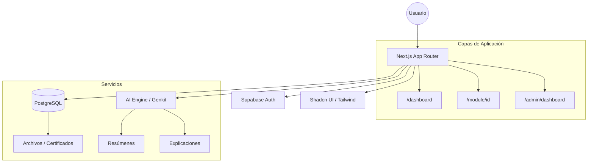

# DiaCero — Plataforma de Entrenamiento Normativo

> **Cero papeleo. 100% digital.** Una experiencia educativa de vanguardia para la capacitación en normativas de seguridad ocupacional en Chile, diseñada para transformar el cumplimiento reactivo en aprendizaje proactivo.

---

## 🚀 Filosofía: El Fin del Papeleo
DiaCero nace con una misión clara: **Digitalización total del proceso de cumplimiento**. 
- **Eficiencia**: Eliminación de registros físicos y carpetas olvidadas.
- **Trazabilidad**: Cada interacción, desde la lectura hasta el examen, queda registrada con firma digital.
- **Accesibilidad**: Formación disponible 24/7 desde cualquier dispositivo móvil en faena.

---

## 🌟 Características Principales

| Feature | Descripción |
|---|---|
| 🔐 **Autenticación Robusta** | Sistema unificado con **Supabase Auth** para un acceso seguro y trazable. |
| 🤖 **Asistente de IA** | Integración nativa con GenAI para resúmenes automáticos y explicaciones adaptativas de conceptos técnicos. |
| 📚 **Módulos Interactivos** | Visor de contenido dinámico con videos, lecturas y seguimiento de progreso en tiempo real. |
| 🎓 **Dashboard Personalizado** | Visualización clara de metas, barra de progreso y descarga inmediata de certificaciones. |
| 🛡️ **Panel de Administración** | KPIs en tiempo real, monitoreo de cumplimiento por cohorte y gestión de usuarios. |
| 🏅 **Certificación Automática** | Generación instantánea de certificados A4 validados al completar satisfactoriamente los módulos. |

---

## 🧬 arquitectura del Sistema



---

## 🛠️ Stack Tecnológico

| Capa | Tecnología |
|---|---|
| **Framework** | [Next.js 15](https://nextjs.org/) (App Router + Turbopack) |
| **Inteligencia Artificial** | [Genkit](https://firebase.google.com/docs/genkit) + Google Gemini Pro |
| **Backend as a Service** | [Supabase](https://supabase.com/) (PostgreSQL, Auth, Storage) |
| **Estilos & UI** | [Tailwind CSS](https://tailwindcss.com/) + [Shadcn UI](https://ui.shadcn.com/) |
| **Visualización** | [Recharts](https://recharts.org/) + [Lucide Icons](https://lucide.dev/) |
| **Lenguaje** | TypeScript 5 |

---

## 🧠 Componentes Inteligentes (AI Features)

La plataforma integra capacidades de IA para mejorar la experiencia de aprendizaje:

1.  **AI Helper (`src/components/module/AIHelper.tsx`)**: 
    - **Punto Clave**: Genera resúmenes ejecutivos de secciones extensas de seguridad.
    - **Explicación Adaptativa**: Utiliza analogías del mundo cotidiano para explicar conceptos técnicos de la normativa chilena.
2.  **Generación de Contexto**: Utiliza `ai-module-summary` y `ai-adaptive-explanation` para personalizar el aprendizaje según la sección actual.

---

## 📁 Estructura del Proyecto

```text
src/
├── ai/                   # Lógica de prompts y flujos de IA (Genkit)
├── app/                  # Sistema de rutas (App Router)
│   ├── admin/            # Panel administrativo y reportes
│   ├── certificate/      # Generación dinámica de certificados
│   ├── dashboard/        # Portal del estudiante
│   └── module/[id]/      # Visor interactivo de cursos
├── components/
│   ├── auth/             # Componentes de Login y Registro
│   ├── module/           # Componentes core: AIHelper, Quiz, Feedback
│   └── ui/               # Librería de componentes visuales (Shadcn)
├── hooks/                # Hooks personalizados (Toast, Mobile detection)
├── lib/                  # Utilidades y configuración compartida
└── utils/supabase/       # Integración con el cliente de base de datos
```

---

## ⚙️ Configuración y Despliegue

### Requisitos Previos
- Cuenta en [Supabase](https://supabase.com/)
- Claves de API de Google AI (para funciones de GenAI)

### Variables de Entorno (.env.local)
```env
NEXT_PUBLIC_SUPABASE_URL=https://<tu-id>.supabase.co
NEXT_PUBLIC_SUPABASE_ANON_KEY=<tu-key>
GOOGLE_GENAI_API_KEY=<tu-google-ai-key>
```

### Comandos de Desarrollo
```bash
npm install         # Instalación
npm run dev         # Desarrollo (Puerto 9002)
npm run build       # Preparar para producción
```

---

## 📄 Licencia y Créditos
Proyecto privado — © DiaCero. Diseñado para transformar la seguridad industrial en Chile.
public/` para sobrescribir el logo SVG predeterminado (detectado automáticamente por `components/ui/logo.tsx`).

---

## 📄 Licencia

Proyecto privado — © DiaCero. Todos los derechos reservados.
