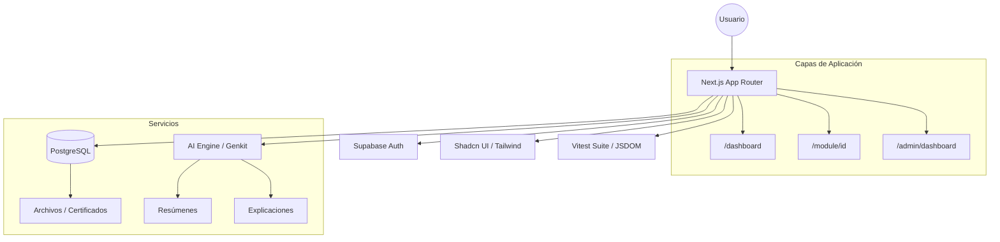

# DiaCero — Plataforma de Entrenamiento Normativo

> **Cero papeleo. 100% digital.** Una experiencia educativa de vanguardia para la capacitación en normativas de seguridad ocupacional en Chile, diseñada para transformar el cumplimiento reactivo en aprendizaje proactivo.

---

## 🚀 Filosofía: El Fin del Papeleo
DiaCero nace con una misión clara: **Digitalización total del proceso de cumplimiento**. 
- **Eficiencia**: Eliminación de registros físicos y carpetas olvidadas.
- **Trazabilidad**: Cada interacción, desde la lectura hasta el examen, queda registrada con firma digital.
- **Accesibilidad**: Formación disponible 24/7 desde cualquier dispositivo móvil en faena.

---

## 🌟 Características Principales

| Feature | Descripción |
|---|---|
| 🔐 **Autenticación Robusta** | Sistema unificado con **Supabase Auth** para un acceso seguro y trazable. |
| 🤖 **Asistente de IA** | Integración nativa con GenAI para resúmenes automáticos y explicaciones adaptativas de conceptos técnicos. |
| 📚 **Módulos Interactivos** | Visor de contenido dinámico con videos, lecturas y seguimiento de progreso en tiempo real. |
| 🛡️ **Seguridad Anti-Trampas** | Medidas de protección de contenido avanzadas contra copias, capturas e impresión no autorizadas. |
| 📱 **Diseño Optimizados para WebKit** | Perfecta visualización y adaptabilidad responsive en Safari (iOS) usando Dynamic Viewports (`dvh`). |
| 🎓 **Dashboard Personalizado** | Visualización clara de metas, barra de progreso y descarga inmediata de certificaciones. |
| 🛡️ **Panel de Administración** | KPIs en tiempo real, monitoreo de cumplimiento por cohorte y gestión de usuarios. |
| 🏅 **Certificación Automática** | Generación instantánea de certificados A4 validados al completar satisfactoriamente los módulos. |

---

## 🛡️ Medidas Anti-Trampas (Protección de Contenido)

Para asegurar la validez de las evaluaciones y proteger la propiedad intelectual del material educativo en faenas críticas, hemos implementado una sólida suite de seguridad en el visor de aprendizaje:

1. **Bloqueo Semántico de Copias (`select-none`)**: El contenido educativo e interactivo se encuentra bajo una restricción de selección por CSS. El alumno no puede sombrear ni seleccionar textos o preguntas.
2. **Inhabilitación del Portapapeles (Copy/Cut/Paste)**: Los eventos de copiado, cortado y pegado son interceptados y anulados. En caso de bypass, se inyecta un texto sustituto disuasorio (*"Contenido protegido por DiaCero."*).
3. **Bloqueo del Menú de Clic Derecho**: Desactivación del menú contextual (`contextmenu`) para impedir la inspección de elementos o accesos rápidos de copia.
4. **Protección Inteligente de Foco (Anti-Capturas de Pantalla)**: 
   - Detecta de forma activa cuándo el usuario pierde el foco de la ventana del navegador (`window.blur`), por ejemplo, al abrir herramientas de recorte (Snipping Tool, Skitch), iniciar grabadores de pantalla o enfocar una ventana en un segundo monitor.
   - En milisegundos, el visor despliega un overlay de cristal esmerilado de alta fidelidad (`backdrop-blur-md`) titulado **"Contenido Protegido"**, bloqueando visualmente el material de estudio e impidiendo capturas en segundo plano.
5. **Restricción de Arrastre de Imágenes**: Se evita la descarga rápida de material gráfico mediante la inhabilitación del evento `dragstart` en imágenes.
6. **Supresión de Impresión y Exportación a PDF**: Se define una consulta de medios `@media print` en los estilos globales que oculta por completo (`display: none !important`) la aplicación si el usuario abre el menú de impresión o intenta guardar el material como un archivo PDF.
7. **Control de Atajos de Teclado**: Se interceptan y bloquean combinaciones clave como la tecla `PrintScreen` (limpiando inmediatamente el portapapeles), `Ctrl/Cmd + P` (imprimir), `Ctrl/Cmd + C` (copiar) y `Ctrl/Cmd + U` (ver código fuente).

---

## 🧬 Arquitectura del Sistema


```mermaid
graph TD
    User((Usuario)) --> NextJS["Next.js App Router"]
    NextJS --> Auth["Supabase Auth"]
    NextJS --> DB[(PostgreSQL)]
    NextJS --> AI["AI Engine / Genkit"]
    NextJS --> UI["Shadcn UI / Tailwind"]
    NextJS --> Tests["Vitest Suite / JSDOM"]
    
    subgraph "Capas de Aplicación"
        NextJS --> Dashboard["/dashboard"]
        NextJS --> Module["/module/id"]
        NextJS --> Admin["/admin/dashboard"]
    end
    
    subgraph "Servicios"
        DB --> Storage["Archivos / Certificados"]
        AI --> Summaries[Resúmenes]
        AI --> Explanations[Explicaciones]
    end
```

---

## 🛠️ Stack Tecnológico

| Capa | Tecnología |
|---|---|
| **Framework** | [Next.js 15](https://nextjs.org/) (App Router + Turbopack) |
| **Pruebas (Testing)** | [Vitest](https://vitest.dev/) + [React Testing Library](https://testing-library.com/) + [JSDOM](https://github.com/jsdom/jsdom) |
| **Inteligencia Artificial** | [Genkit](https://firebase.google.com/docs/genkit) + Google Gemini Pro |
| **Backend as a Service** | [Supabase](https://supabase.com/) (PostgreSQL, Auth, Storage) |
| **Estilos & UI** | [Tailwind CSS](https://tailwindcss.com/) + [Shadcn UI](https://ui.shadcn.com/) |
| **Visualización** | [Recharts](https://recharts.org/) + [Lucide Icons](https://lucide.dev/) |
| **Lenguaje** | TypeScript 5 |

---

## 🧪 Entorno de Pruebas (Unit Testing)

Contamos con una suite completa de pruebas unitarias y de simulación para validar la lógica funcional y de componentes sin requerir servicios en la nube activos.

### Pruebas Cubiertas:
1. **Funciones Utilitarias (`src/lib/utils.test.ts`)**: Cobertura de combinación de estilos dinámicos de Tailwind CSS (`clsx` + `tailwind-merge`).
2. **Componente Cuestionario (`src/components/module/Quiz.test.tsx`)**: Simulación interactiva de respuestas, retroalimentación en tiempo real (respuestas correctas/incorrectas), flujo de avance y lógica de finalización con reporte de puntaje exacto.
3. **Encuesta de Comentarios (`src/components/module/FeedbackSurvey.test.tsx`)**: Validación de estados de envío de formularios, valoraciones por estrellas y simulación de delay asíncrono con **Fake Timers** de Vitest.

### Comandos de Pruebas:
- **Modo Watch (Desarrollo Interactivo)**:
  ```bash
  npm run test
  ```
- **Modo Ejecución Única (CI/CD)**:
  ```bash
  npm run test:run
  ```

---

## 🧠 Componentes Inteligentes (AI Features)

La plataforma integra capacidades de IA para mejorar la experiencia de aprendizaje:

1.  **AI Helper (`src/components/module/AIHelper.tsx`)**: 
    - **Punto Clave**: Genera resúmenes ejecutivos de secciones extensas de seguridad.
    - **Explicación Adaptativa**: Utiliza analogías del mundo cotidiano para explicar conceptos técnicos de la normativa chilena.
2.  **Generación de Contexto**: Utiliza `ai-module-summary` y `ai-adaptive-explanation` para personalizar el aprendizaje según la sección actual.

---

## 📁 Estructura del Proyecto

```text
src/
├── ai/                   # Lógica de prompts y flujos de IA (Genkit)
├── app/                  # Sistema de rutas (App Router)
│   ├── admin/            # Panel administrativo y reportes
│   ├── certificate/      # Generación dinámica de certificados
│   ├── dashboard/        # Portal del estudiante
│   └── module/[id]/      # Visor interactivo de cursos
├── components/
│   ├── auth/             # Componentes de Login y Registro
│   ├── module/           # Componentes core: AIHelper, Quiz (con Tests), Feedback (con Tests)
│   └── ui/               # Librería de componentes visuales (Shadcn)
├── hooks/                # Hooks personalizados (Toast, Mobile detection)
├── lib/                  # Utilidades (con Tests) y configuración compartida
└── utils/supabase/       # Integración con el cliente de base de datos
```

---

## ⚙️ Configuración y Despliegue

### Requisitos Previos
- Cuenta en [Supabase](https://supabase.com/)
- Claves de API de Google AI (para funciones de GenAI)

### Variables de Entorno (.env.local)
```env
NEXT_PUBLIC_SUPABASE_URL=https://<tu-id>.supabase.co
NEXT_PUBLIC_SUPABASE_ANON_KEY=<tu-key>
GOOGLE_GENAI_API_KEY=<tu-google-ai-key>
```

### Comandos de Desarrollo
```bash
npm install         # Instalación de dependencias
npm run dev         # Desarrollo local (Puerto 9002)
npm run typecheck   # Validación de tipos estáticos en TS
npm run build       # Compilación y empaquetamiento para producción
```

---

## 📄 Licencia

Proyecto privado — © DiaCero. Todos los derechos reservados. Diseñado para transformar la seguridad industrial en Chile.
