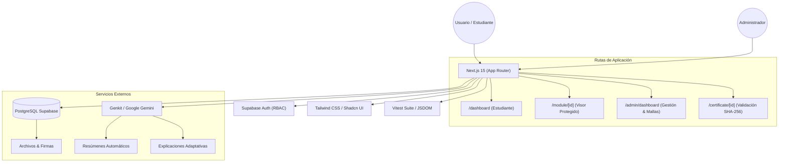

# DiaCero — Plataforma de Entrenamiento Normativo


> **Cero papeleo. 100% digital.** Una experiencia educativa de vanguardia para la capacitación en normativas de seguridad ocupacional en Chile, diseñada para transformar el cumplimiento reactivo en aprendizaje proactivo.

---

## 🚀 Filosofía: El Fin del Papeleo
DiaCero nace con una misión clara: **Digitalización total del proceso de cumplimiento**. 
- **Eficiencia**: Eliminación de registros físicos y carpetas olvidadas.
- **Trazabilidad**: Cada interacción, desde la lectura hasta el examen, queda registrada con firma digital y hash criptográfico.
- **Accesibilidad**: Formación disponible 24/7 desde cualquier dispositivo móvil en faena.

---

## 🌟 Características Principales

| Feature | Descripción |
|---|---|
| 🔐 **Autenticación y Roles RBAC** | Sistema unificado con **Supabase Auth** y panel administrativo para asignación de roles (`admin`, `student`) y actualización de contraseñas. |
| 🛠️ **Constructor Teórico y de Quizzes** | Panel interactivo para editar módulos, redactar diapositivas con barra de formato (negrita, punteo, numeración), multimedia y editor de preguntas. |
| 🤖 **Asistente de IA (Genkit)** | Resúmenes automáticos y explicaciones adaptativas con analogías cotidianas para conceptos técnicos complejos de la legislación chilena. |
| 📚 **Visor de Módulos Dinámico** | Experiencia interactiva para el alumno con video explicativo, diapositivas estructuradas y barra de avance en tiempo real. |
| 🛡️ **Seguridad Anti-Trampas** | Protección contra copia (`select-none`), inhabilitación de portapapeles, bloqueo de clic derecho y detección de pérdida de foco (`window.blur`). |
| 📱 **Diseño 100% Responsive** | Interfaz adaptada minuciosamente para smartphones, tablets y pantallas de escritorio, optimizada para WebKit/Safari (`dvh`). |
| 📊 **Panel de Control y Métricas** | KPIs en tiempo real: tasa de aprobación, progreso global, desglose por cohorte y auditoría de altas inmediatas. |
| 🏅 **Certificación Criptográfica** | Certificados A4 emitidos al instante con folio único y código hash de validación SHA-256 verificable. |

---

## 🛠️ Panel de Administración y Creación de Contenidos

El panel administrativo (`/admin/dashboard`) integra herramientas de última generación para la gestión integral de la academia:

1. **Constructor Teórico & Evaluaciones (Mallas)**:
   - **Gestión de Módulos**: Selección de cursos, creación rápida y renombrado de títulos/descripciones.
   - **Editor de Diapositivas**: Redacción de contenido con barra de formato enriquecido (**Negrita**, **Punteo** y **Numeración correlativa automática**).
   - **Soporte Multimedia**: Integración de URLs de video de YouTube e imágenes de portada por lección.
   - **Asistente IA Integrado**: Generación instantánea de resúmenes ejecutivos y analogías adaptativas con un solo clic.
   - **Control de Borradores**: Detección de cambios locales no sincronizados y guardado masivo con un solo botón.

2. **Gestor y Banco de Quizzes**:
   - Selector interactivo de preguntas y respuestas de 4 opciones (`Opción A`, `B`, `C`, `D`).
   - Selección visual de respuesta correcta mediante botones de radio de alta fidelidad.
   - Edición modal en caliente y eliminación segura de preguntas.

3. **Control de Cuentas, Roles y Asignaciones**:
   - Visualización de usuarios registrados, roles asignados y estado de cursos.
   - Actualización directa de contraseña desde el panel de control.
   - Concesión de "Alta Inmediata" para acelerar el ingreso de nuevos colaboradores.
   - Diseño optimizado sin desbordes para uso fluido desde dispositivos móviles en terreno.

---

## 🛡️ Medidas Anti-Trampas (Protección de Contenido)

Para asegurar la validez de las evaluaciones y proteger la propiedad intelectual del material educativo en faenas críticas:

1. **Bloqueo Semántico de Copias (`select-none`)**: Restricción CSS para impedir la selección o sombreado de textos y preguntas.
2. **Inhabilitación del Portapapeles (Copy/Cut/Paste)**: Los eventos de copiado son interceptados e inyectan el aviso disuasorio: *"Contenido protegido por DiaCero."*
3. **Bloqueo del Menú de Clic Derecho**: Desactivación de `contextmenu` para evitar inspección o accesos rápidos del navegador.
4. **Protección Inteligente de Foco (Anti-Capturas)**: Detección en tiempo real de pérdida de foco (`window.blur`). Despliega de inmediato una capa de cristal esmerilado (`backdrop-blur-md`) con el aviso **"Contenido Protegido"** ante intentos de uso de herramientas de recorte (Snipping Tool, Skitch, etc.).
5. **Supresión de Impresión**: Regla `@media print` que oculta el contenido (`display: none !important`) si se intenta imprimir o exportar a PDF no autorizado.
6. **Intercepción de Atajos de Teclado**: Bloqueo de combinaciones como `PrintScreen`, `Ctrl/Cmd + P`, `Ctrl/Cmd + C` y `Ctrl/Cmd + U`.

---

## 🧬 Arquitectura del Sistema


```mermaid
graph TD
    User((Usuario / Estudiante)) --> NextJS["Next.js 15 (App Router)"]
    Admin((Administrador)) --> NextJS
    NextJS --> Auth["Supabase Auth (RBAC)"]
    NextJS --> DB[(PostgreSQL Supabase)]
    NextJS --> AI["Genkit / Google Gemini"]
    NextJS --> UI["Tailwind CSS / Shadcn UI"]
    NextJS --> Tests["Vitest Suite / JSDOM"]
    
    subgraph "Rutas de Aplicación"
        NextJS --> Dashboard["/dashboard (Estudiante)"]
        NextJS --> Module["/module/[id] (Visor Protegido)"]
        NextJS --> AdminDash["/admin/dashboard (Gestión & Mallas)"]
        NextJS --> Cert["/certificate/[id] (Validación SHA-256)"]
    end
    
    subgraph "Servicios Externos"
        DB --> Storage["Archivos & Firmas"]
        AI --> Summaries["Resúmenes Automáticos"]
        AI --> Analogies["Explicaciones Adaptativas"]
    end
```

---

## 🛠️ Stack Tecnológico

| Capa | Tecnología |
|---|---|
| **Framework Web** | [Next.js 15](https://nextjs.org/) (App Router + Turbopack) |
| **Pruebas (Testing)** | [Vitest](https://vitest.dev/) + [React Testing Library](https://testing-library.com/) + [JSDOM](https://github.com/jsdom/jsdom) |
| **Inteligencia Artificial** | [Genkit](https://firebase.google.com/docs/genkit) + Google Gemini |
| **Backend as a Service** | [Supabase](https://supabase.com/) (PostgreSQL, Row Level Security, Auth) |
| **Estilos & UI** | [Tailwind CSS](https://tailwindcss.com/) + [Shadcn UI](https://ui.shadcn.com/) |
| **Visualización e Iconos** | [Recharts](https://recharts.org/) + [Lucide React](https://lucide.dev/) |
| **Lenguaje** | TypeScript 5 (Strict Mode) |

---

## 🧪 Entorno de Pruebas (Unit Testing)

La suite de pruebas automatizadas garantiza la robustez y previene regresiones funcionales:

```bash
# Ejecutar todas las pruebas unitarias
npm run test:run

# Modo interactivo / observador
npm run test
```

### Cobertura de Suites de Prueba (17 Tests — 100% Aprobados):
1. **`src/lib/utils.test.ts`**: Fusión y precedencia de clases dinámicas Tailwind (`cn`).
2. **`src/lib/cert-hash.test.ts`**: Verificación y consistencia del algoritmo criptográfico SHA-256 para emisión de certificados.
3. **`src/components/module/Quiz.test.tsx`**: Flujo completo de evaluación, habilitación de envíos, feedback de opciones correctas/incorrectas, paginación de preguntas y cálculo de puntaje.
4. **`src/components/module/FeedbackSurvey.test.tsx`**: Comportamiento de encuestas de satisfacción, rating por estrellas y simulación asíncrona de envío con fake timers.

---

## 📁 Estructura del Proyecto

```text
src/
├── ai/                   # Flujos de IA y prompts estructurados (Genkit)
├── app/                  # Rutas de la plataforma (Next.js App Router)
│   ├── admin/            # Panel administrativo, analíticas y gestión de mallas
│   ├── certificate/      # Emisión y validación pública de diplomas
│   ├── dashboard/        # Centro de capacitación para alumnos
│   └── module/[id]/      # Visor interactivo y seguro de lecciones
├── components/
│   ├── admin/            # Componentes de administración (Builder, Quizzes, Cuentas)
│   ├── auth/             # Formularios de autenticación y control de accesos
│   ├── module/           # Componentes core: AIHelper, Quiz, FeedbackSurvey
│   └── ui/               # Componentes atómicos de diseño (Shadcn UI)
├── hooks/                # Custom React Hooks (TheoryBuilder, Toasts, Responsive)
├── lib/                  # Funciones utilitarias, hashing y tests unitarios
└── utils/supabase/       # Conectores y clientes de Supabase (Client, Server)
```

---

## ⚙️ Configuración y Despliegue

### Variables de Entorno (`.env.local`)
```env
NEXT_PUBLIC_SUPABASE_URL=https://<tu-id>.supabase.co
NEXT_PUBLIC_SUPABASE_ANON_KEY=<tu-anon-key>
GOOGLE_GENAI_API_KEY=<tu-google-ai-key>
```

### Comandos de Desarrollo
```bash
npm install         # Instalar dependencias del proyecto
npm run dev         # Servidor de desarrollo local (Puerto 9002)
npm run typecheck   # Validación estricta de tipos de TypeScript (tsc --noEmit)
npm run test:run    # Ejecución de la suite completa de pruebas unitarias
npm run build       # Compilación y optimización para producción
```

---

## 🏷️ Historial de Versiones

### [v3.0.0-release] — 2026-09-03
- **Constructor Teórico**: Adición de toolbar de edición enriquecida con soporte para **Negrita**, **Punteo** y **Numeración ordenada**.
- **Gestor de Quizzes**: Paleta renovada en tonos ámbar/amarillo cálido, ícono vectorial SVG azul para respuesta correcta y placeholder intuitivo.
- **Control de Cuentas**: Diseño 100% responsivo para celulares, badge "Alta Inmediata" sin desbordes y actualización directa de credenciales.
- **Arquitectura & Estabilidad**: Cobertura ampliada a 17 tests unitarios con Vitest y validación de tipos TypeScript en estricto cero errores.

---

## 📄 Licencia

Proyecto privado — © DiaCero. Todos los derechos reservados. Diseñado para transformar la capacitación y seguridad industrial en Chile.
