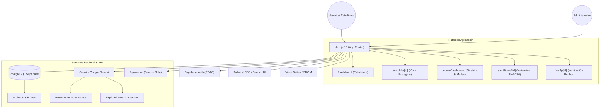

# DiaCero — Plataforma de Entrenamiento Normativo


> **Cero papeleo. 100% digital.** Una experiencia educativa de vanguardia para la capacitación en normativas de seguridad ocupacional en Chile, diseñada para transformar el cumplimiento reactivo en aprendizaje proactivo.

---

## 🚀 Filosofía: El Fin del Papeleo
DiaCero nace con una misión clara: **Digitalización total del proceso de cumplimiento**. 
- **Eficiencia**: Eliminación de registros físicos y carpetas olvidadas.
- **Trazabilidad**: Cada interacción, desde la lectura hasta el examen, queda registrada con firma digital y hash criptográfico.
- **Accesibilidad**: Formación disponible 24/7 desde cualquier dispositivo móvil en faena.

---

## 🌟 Características Principales

| Feature | Descripción |
|---|---|
| 🔐 **Autenticación y Roles RBAC** | Sistema unificado con **Supabase Auth** y panel administrativo para asignación de roles (`admin`, `student`) y actualización de contraseñas. |
| 🛠️ **Constructor Teórico y de Quizzes** | Panel interactivo para editar módulos, redactar diapositivas con barra de formato (negrita, punteo, numeración), multimedia y editor de preguntas. |
| 🤖 **Asistente de IA (Genkit)** | Resúmenes automáticos y explicaciones adaptativas con analogías cotidianas para conceptos técnicos complejos de la legislación chilena. |
| 📚 **Visor de Módulos Dinámico** | Experiencia interactiva para el alumno con video explicativo, diapositivas estructuradas y barra de avance en tiempo real. |
| 🛡️ **Seguridad Anti-Trampas** | Protección contra copia (`select-none`), inhabilitación de portapapeles, bloqueo de clic derecho y detección de pérdida de foco (`window.blur`). |
| 📱 **Diseño 100% Responsive** | Interfaz adaptada minuciosamente para smartphones, tablets y pantallas de escritorio, optimizada para WebKit/Safari (`dvh`). |
| 📊 **Panel de Control y Métricas** | KPIs en tiempo real: tasa de aprobación, progreso global, desglose por cohorte y auditoría de altas inmediatas. |
| 🏅 **Certificación Criptográfica** | Certificados A4 emitidos al instante con folio único y código hash de validación SHA-256 verificable. |

---

## 🛠️ Panel de Administración y Creación de Contenidos

El panel administrativo (`/admin/dashboard`) integra herramientas de última generación para la gestión integral de la academia:

1. **Constructor Teórico & Evaluaciones (Mallas)**:
   - **Gestión de Módulos**: Selección de cursos, creación rápida y renombrado de títulos/descripciones.
   - **Editor de Diapositivas**: Redacción de contenido con barra de formato enriquecido (**Negrita**, **Punteo** y **Numeración correlativa automática**).
   - **Soporte Multimedia**: Integración de URLs de video de YouTube e imágenes de portada por lección.
   - **Asistente IA Integrado**: Generación instantánea de resúmenes ejecutivos y analogías adaptativas con un solo clic.
   - **Control de Borradores**: Detección de cambios locales no sincronizados y guardado masivo con un solo botón.

2. **Gestor y Banco de Quizzes**:
   - Selector interactivo de preguntas y respuestas de 4 opciones (`Opción A`, `B`, `C`, `D`).
   - Selección visual de respuesta correcta mediante botones de radio de alta fidelidad en azul normativo.
   - Edición modal en caliente y eliminación segura de preguntas.

3. **Control de Cuentas, Roles y Asignaciones**:
   - Visualización de usuarios registrados, roles asignados y estado de cursos.
   - Actualización directa de contraseña desde el panel de control.
   - Concesión de "Alta Inmediata" para acelerar el ingreso de nuevos colaboradores.
   - Diseño optimizado sin desbordes para uso fluido desde dispositivos móviles en terreno.

---

## 🛡️ Medidas Anti-Trampas (Protección de Contenido)

Para asegurar la validez de las evaluaciones y proteger la propiedad intelectual del material educativo en faenas críticas:

1. **Bloqueo Semántico de Copias (`select-none`)**: Restricción CSS para impedir la selección o sombreado de textos y preguntas.
2. **Inhabilitación del Portapapeles (Copy/Cut/Paste)**: Los eventos de copiado son interceptados e inyectan el aviso disuasorio: *"Contenido protegido por DiaCero."*
3. **Bloqueo del Menú de Clic Derecho**: Desactivación de `contextmenu` para evitar inspección o accesos rápidos del navegador.
4. **Protección Inteligente de Foco (Anti-Capturas)**: Detección en tiempo real de pérdida de foco (`window.blur`). Despliega de inmediato una capa de cristal esmerilado (`backdrop-blur-md`) con el aviso **"Contenido Protegido"** ante intentos de uso de herramientas de recorte (Snipping Tool, Skitch, etc.).
5. **Supresión de Impresión**: Regla `@media print` que oculta el contenido (`display: none !important`) si se intenta imprimir o exportar a PDF no autorizado.
6. **Intercepción de Atajos de Teclado**: Bloqueo de combinaciones como `PrintScreen`, `Ctrl/Cmd + P`, `Ctrl/Cmd + C` y `Ctrl/Cmd + U`.

---

## 🧬 Arquitectura del Sistema


```mermaid
graph TD
    User((Usuario / Estudiante)) --> NextJS["Next.js 16 (App Router)"]
    Admin((Administrador)) --> NextJS
    NextJS --> Auth["Supabase Auth (RBAC)"]
    NextJS --> DB[(PostgreSQL Supabase)]
    NextJS --> AI["Genkit / Google Gemini"]
    NextJS --> UI["Tailwind CSS / Shadcn UI"]
    NextJS --> Tests["Vitest Suite / JSDOM"]
    
    subgraph "Rutas de Aplicación"
        NextJS --> Dashboard["/dashboard (Estudiante)"]
        NextJS --> Module["/module/[id] (Visor Protegido)"]
        NextJS --> AdminDash["/admin/dashboard (Gestión & Mallas)"]
        NextJS --> Cert["/certificate/[id] (Validación SHA-256)"]
        NextJS --> Verify["/verify/[id] (Verificación Pública)"]
    end
    
    subgraph "Servicios Backend & API"
        DB --> Storage["Archivos & Firmas"]
        NextJS --> API["/api/admin (Service Role)"]
        AI --> Summaries["Resúmenes Automáticos"]
        AI --> Analogies["Explicaciones Adaptativas"]
    end
```

---

## 🛠️ Stack Tecnológico

| Capa | Tecnología |
|---|---|
| **Framework Web** | [Next.js 16](https://nextjs.org/) (v16.3.4, App Router + Turbopack) |
| **Librería UI Base** | [React 19](https://react.dev/) (v19.2.1) |
| **Pruebas (Testing)** | [Vitest](https://vitest.dev/) + [React Testing Library](https://testing-library.com/) + [JSDOM](https://github.com/jsdom/jsdom) |
| **Inteligencia Artificial** | [Genkit](https://firebase.google.com/docs/genkit) + Google Gemini |
| **Backend as a Service** | [Supabase](https://supabase.com/) (PostgreSQL, Row Level Security, Auth, Service Role) |
| **Estilos & UI** | [Tailwind CSS](https://tailwindcss.com/) + [Shadcn UI](https://ui.shadcn.com/) |
| **Visualización e Iconos** | [Recharts](https://recharts.org/) + [Lucide React](https://lucide.dev/) |
| **Lenguaje** | TypeScript 5 (Strict Mode) |

---

## 🧪 Entorno de Pruebas (Unit Testing)

La suite de pruebas automatizadas garantiza la robustez y previene regresiones funcionales:

```bash
# Ejecutar todas las pruebas unitarias
npm run test:run

# Modo interactivo / observador
npm run test
```

### Cobertura de Suites de Prueba (73 Tests — 100% Aprobados, 8 Suites):
1. **`src/lib/certificates-and-progress.test.ts`**: Métricas de avance individual y multi-módulo, cálculo de avance promedio de cohortes (AdminStatsCards), criterio de elegibilidad para certificados (100%), folios únicos `DC-[HASH]` y validación criptográfica anti-adulteración.
2. **`src/lib/quiz-manager.test.ts`**: Gestión integral de quizzes: creación de contenedor evaluativo, validación estricta de preguntas (4 opciones, enunciados no vacíos, puntero a alternativa correcta), edición en caliente y eliminación segura de preguntas.
3. **`src/app/api/admin/modules/route.test.ts`**: Creación, edición, generación de slugs limpios con normalización de acentos y eliminación en cascada de módulos (quizzes, secciones y progresos).
4. **`src/app/api/admin/users/route.test.ts`**: Control total de cuentas: altas inmediatas, actualización de roles (`admin`/`estudiante`), reseteo de contraseñas, bajas de usuarios y protección estricta de la cuenta administradora raíz.
5. **`src/lib/progress-tracker.test.ts`**: Cálculo algorítmico de avance por módulo, prevención de división por cero, promedio general del estudiante y endpoints de asignación/desvinculación de cursos.
6. **`src/lib/utils.test.ts`**: Fusión y precedencia de clases dinámicas Tailwind (`cn`).
7. **`src/lib/cert-hash.test.ts`**: Verificación y consistencia del algoritmo criptográfico SHA-256 para emisión de certificados.
8. **`src/components/module/Quiz.test.tsx`**: Flujo completo de evaluación del estudiante, habilitación de envíos, feedback de opciones correctas/incorrectas, paginación y cálculo de puntaje.

---

## 📁 Estructura del Proyecto

```text
src/
├── ai/                   # Flujos de IA y prompts estructurados (Genkit + Gemini)
│   ├── dev.ts            # Servidor local de desarrollo Genkit
│   ├── genkit.ts         # Inicialización del cliente de IA
│   └── flows/            # Flujos ejecutables (resúmenes y explicaciones adaptativas)
├── app/                  # Rutas de la plataforma (Next.js 16 App Router)
│   ├── admin/            # Panel administrativo, analíticas y constructor de mallas
│   ├── api/              # Endpoints backend (users, modules, assignments, progress, verify)
│   ├── auth/             # Flujos de autenticación e inicio de sesión
│   ├── certificate/      # Emisión y visualización de diplomas
│   ├── dashboard/        # Centro de capacitación para estudiantes
│   ├── module/[id]/      # Visor interactivo y protegido de lecciones
│   ├── settings/         # Ajustes de perfil del usuario
│   └── verify/           # Verificación pública de certificados criptográficos
├── components/           # Componentes organizados por dominio
│   ├── admin/            # Paneles de gestión: TheoryContentBuilder, UserAccountControl, QuizManager, ModuleAssignment, AdminStats
│   ├── auth/             # Formularios y control de acceso (LoginForm)
│   ├── dashboard/        # Componentes del portal del alumno (MotivationalCarousel)
│   ├── module/           # Experiencia de aprendizaje interactiva: AIHelper, Quiz
│   └── ui/               # Componentes atómicos de diseño (Shadcn UI + Radix Primitives)
├── hooks/                # Custom React Hooks (useTheoryBuilder, useAdminUsers, useQuizManager)
├── lib/                  # Utilidades, hashing criptográfico y suites de pruebas unitarias
│   ├── cert-hash.ts      # Generación de folios DC-[HASH] y firma QR
│   ├── cert-hash.test.ts # Tests de validación y firma de certificados
│   ├── certificates-and-progress.test.ts # Tests de métricas, cohortes y diplomas
│   ├── progress-tracker.test.ts # Tests de tracking de avance y asignaciones
│   ├── quiz-manager.test.ts # Tests de creación, edición y borrado de preguntas
│   └── utils.test.ts     # Tests de utilidades y fusión de clases Tailwind
└── utils/supabase/       # Conectores de Supabase (Client para el navegador, Server para SSR/API)
```

---

## 🗄️ Base de Datos & Scripts SQL (Supabase)

Para inicializar la base de datos en un proyecto nuevo de Supabase, ejecuta el siguiente script en el **SQL Editor** del panel de Supabase. El script completo también se encuentra guardado en [`supabase/schema.sql`](supabase/schema.sql).

Crea automáticamente:
1. **`public.profiles`**: Tabla de perfiles con roles (`student`, `admin`) sincronizada con `auth.users`.
2. **`public.handle_new_user()`**: Trigger automático que da de alta el perfil cada vez que un usuario se registra.
3. **`public.modules`**: Módulos y cursos académicos de seguridad laboral.
4. **`public.module_sections`**: Diapositivas teóricas y secciones de quiz asociadas al módulo.
5. **`public.quiz_questions`**: Banco de preguntas de evaluación (formato 4 opciones con índice de respuesta correcta).
6. **`public.user_progress`**: Registro de avance, secciones completadas, calificaciones y certificados.
7. **Políticas RLS (Row Level Security)**: Seguridad por fila para aislar el progreso de los alumnos y otorgar control a los administradores.
8. **Datos Semilla (Seed Data)**: Módulo Piloto Ley 16.744, diapositivas teóricas y preguntas de examen listas para usar.

```sql
-- ==============================================================================
-- DiaCero — Script de Base de Datos Oficial (Supabase / PostgreSQL)
-- ==============================================================================
CREATE EXTENSION IF NOT EXISTS "uuid-ossp";
CREATE EXTENSION IF NOT EXISTS "pgcrypto";

-- 1. TABLA: public.profiles (Perfiles de usuario)
CREATE TABLE IF NOT EXISTS public.profiles (
    id UUID NOT NULL,
    name TEXT NOT NULL,
    email TEXT NOT NULL UNIQUE,
    role TEXT NOT NULL DEFAULT 'estudiante'::text,
    last_active TIMESTAMP WITH TIME ZONE DEFAULT now(),
    created_at TIMESTAMP WITH TIME ZONE DEFAULT now(),
    CONSTRAINT profiles_pkey PRIMARY KEY (id),
    CONSTRAINT profiles_id_fkey FOREIGN KEY (id) REFERENCES auth.users(id) ON DELETE CASCADE
);

ALTER TABLE public.profiles ENABLE ROW LEVEL SECURITY;

CREATE POLICY "Lectura de perfiles para usuarios autenticados"
ON public.profiles FOR SELECT TO authenticated USING (true);

CREATE POLICY "Los usuarios pueden actualizar su propio perfil"
ON public.profiles FOR UPDATE TO authenticated USING (auth.uid() = id) WITH CHECK (auth.uid() = id);

CREATE POLICY "Acceso total para service_role y administradores"
ON public.profiles FOR ALL TO authenticated
USING (
    auth.uid() = id OR 
    EXISTS (SELECT 1 FROM public.profiles WHERE id = auth.uid() AND role = 'admin')
);

-- 2. TRIGGER: Sincronización automática de perfil al registrarse en Auth
CREATE OR REPLACE FUNCTION public.handle_new_user()
RETURNS TRIGGER AS $$
BEGIN
    INSERT INTO public.profiles (id, email, name, role, last_active)
    VALUES (
        NEW.id,
        NEW.email,
        COALESCE(NEW.raw_user_meta_data->>'name', split_part(NEW.email, '@', 1)),
        COALESCE(NEW.raw_user_meta_data->>'role', 'estudiante'),
        now()
    )
    ON CONFLICT (id) DO UPDATE
    SET 
        email = EXCLUDED.email,
        name = COALESCE(EXCLUDED.name, public.profiles.name),
        last_active = now();
    RETURN NEW;
END;
$$ LANGUAGE plpgsql SECURITY DEFINER;

DROP TRIGGER IF EXISTS on_auth_user_created ON auth.users;
CREATE TRIGGER on_auth_user_created
    AFTER INSERT ON auth.users
    FOR EACH ROW EXECUTE FUNCTION public.handle_new_user();

-- 3. TABLA: public.modules (Módulos y Cursos de Capacitación)
CREATE TABLE IF NOT EXISTS public.modules (
    id TEXT NOT NULL,
    title TEXT NOT NULL,
    description TEXT NOT NULL,
    created_at TIMESTAMP WITH TIME ZONE DEFAULT now(),
    CONSTRAINT modules_pkey PRIMARY KEY (id)
);

ALTER TABLE public.modules ENABLE ROW LEVEL SECURITY;

CREATE POLICY "Módulos visibles para todos los usuarios autenticados"
ON public.modules FOR SELECT TO authenticated USING (true);

CREATE POLICY "Gestión de módulos para administradores"
ON public.modules FOR ALL TO authenticated
USING (EXISTS (SELECT 1 FROM public.profiles WHERE id = auth.uid() AND role = 'admin'));

-- 4. TABLA: public.module_sections (Diapositivas y contenedor de examen)
CREATE TABLE IF NOT EXISTS public.module_sections (
    id TEXT NOT NULL,
    module_id TEXT,
    title TEXT NOT NULL,
    type TEXT NOT NULL,
    content TEXT,
    video_url TEXT,
    image_url TEXT,
    image_hint TEXT,
    sort_order INTEGER NOT NULL,
    created_at TIMESTAMP WITH TIME ZONE DEFAULT now(),
    ai_summary TEXT,
    ai_explanation TEXT,
    CONSTRAINT module_sections_pkey PRIMARY KEY (id),
    CONSTRAINT module_sections_module_id_fkey FOREIGN KEY (module_id) REFERENCES public.modules(id) ON DELETE CASCADE
);

ALTER TABLE public.module_sections ENABLE ROW LEVEL SECURITY;

CREATE POLICY "Secciones visibles para usuarios autenticados"
ON public.module_sections FOR SELECT TO authenticated USING (true);

CREATE POLICY "Gestión de secciones para administradores"
ON public.module_sections FOR ALL TO authenticated
USING (EXISTS (SELECT 1 FROM public.profiles WHERE id = auth.uid() AND role = 'admin'));

-- 5. TABLA: public.quiz_questions (Banco de preguntas de exámenes)
CREATE TABLE IF NOT EXISTS public.quiz_questions (
    id TEXT NOT NULL,
    section_id TEXT,
    question TEXT NOT NULL,
    options JSONB NOT NULL,
    correct_answer INTEGER NOT NULL,
    created_at TIMESTAMP WITH TIME ZONE DEFAULT now(),
    CONSTRAINT quiz_questions_pkey PRIMARY KEY (id),
    CONSTRAINT quiz_questions_section_id_fkey FOREIGN KEY (section_id) REFERENCES public.module_sections(id) ON DELETE CASCADE
);

ALTER TABLE public.quiz_questions ENABLE ROW LEVEL SECURITY;

CREATE POLICY "Preguntas visibles para usuarios autenticados"
ON public.quiz_questions FOR SELECT TO authenticated USING (true);

CREATE POLICY "Gestión de preguntas para administradores"
ON public.quiz_questions FOR ALL TO authenticated
USING (EXISTS (SELECT 1 FROM public.profiles WHERE id = auth.uid() AND role = 'admin'));

-- 6. TABLA: public.user_progress (Progreso de los alumnos)
CREATE TABLE IF NOT EXISTS public.user_progress (
    id UUID NOT NULL DEFAULT uuid_generate_v4(),
    user_id UUID,
    module_id TEXT,
    completed_sections JSONB DEFAULT '[]'::jsonb,
    quiz_scores JSONB DEFAULT '{}'::jsonb,
    current_section_index INTEGER DEFAULT 0,
    updated_at TIMESTAMP WITH TIME ZONE DEFAULT now(),
    CONSTRAINT user_progress_pkey PRIMARY KEY (id),
    CONSTRAINT user_progress_user_id_fkey FOREIGN KEY (user_id) REFERENCES auth.users(id) ON DELETE CASCADE,
    CONSTRAINT user_progress_module_id_fkey FOREIGN KEY (module_id) REFERENCES public.modules(id) ON DELETE CASCADE,
    CONSTRAINT unique_user_module UNIQUE (user_id, module_id)
);

ALTER TABLE public.user_progress ENABLE ROW LEVEL SECURITY;

CREATE POLICY "Estudiantes pueden ver su propio progreso"
ON public.user_progress FOR SELECT TO authenticated
USING (user_id = auth.uid() OR EXISTS (SELECT 1 FROM public.profiles WHERE id = auth.uid() AND role = 'admin'));

CREATE POLICY "Estudiantes pueden registrar su progreso"
ON public.user_progress FOR INSERT TO authenticated
WITH CHECK (user_id = auth.uid());

CREATE POLICY "Estudiantes pueden actualizar sus avances"
ON public.user_progress FOR UPDATE TO authenticated
USING (user_id = auth.uid()) WITH CHECK (user_id = auth.uid());

CREATE POLICY "Administradores gestionan todo el progreso"
ON public.user_progress FOR ALL TO authenticated
USING (EXISTS (SELECT 1 FROM public.profiles WHERE id = auth.uid() AND role = 'admin'));

-- 7. DATOS SEMILLA (Seed Data — Módulo Piloto Ley 16.744)
INSERT INTO public.modules (id, title, description)
VALUES (
    'mod-1',
    'Módulo Piloto: Seguridad Laboral (Ley 16.744)',
    'Capacitación inicial obligatoria sobre prevención de riesgos laborales y normativas de seguridad ocupacional en Chile.'
)
ON CONFLICT (id) DO UPDATE SET title = EXCLUDED.title, description = EXCLUDED.description;

INSERT INTO public.module_sections (id, module_id, title, type, content, sort_order)
VALUES 
(
    'sec-1-1', 'mod-1', 'Conceptos Fundamentales de Prevención', 'content',
    'La **Ley 16.744** establece normas sobre accidentes del trabajo y enfermedades profesionales en Chile. Su objetivo es otorgar cobertura médica integral y preventiva a todos los trabajadores del país.',
    0
),
(
    'sec-1-2', 'mod-1', 'Identificación de Peligros Comunes', 'content',
    'En toda faena es indispensable realizar la identificación de riesgos antes de iniciar cualquier labor:
1. Inspeccionar el entorno inmediato de trabajo.
2. Comprobar el uso correcto de los Elementos de Protección Personal (EPP).
3. Reportar oportunamente condiciones subestándar.',
    1
),
(
    'sec-1-3', 'mod-1', 'Procedimiento ante Emergencias', 'content',
    'Ante una contingencia, el protocolo **PAS** salva vidas:
• **Proteger**: Asegurar el área antes de intervenir.
• **Avisar**: Notificar inmediatamente a la jefatura y brigada de emergencia.
• **Socorrer**: Atender a las personas afectadas sólo si estás capacitado.',
    2
),
(
    'sec-1-quiz', 'mod-1', 'Evaluación Final del Módulo', 'quiz',
    'Cuestionario evaluativo para validar la asimilación de conceptos clave de la Ley 16.744.',
    3
)
ON CONFLICT (id) DO NOTHING;

INSERT INTO public.quiz_questions (id, section_id, question, options, correct_answer)
VALUES
(
    'q-1-1', 'sec-1-quiz',
    '¿Cuál es la ley que rige los accidentes de trabajo en Chile?',
    '["Ley 19.300", "Ley 20.001", "Ley 16.744", "Ley de Tránsito"]'::jsonb,
    2
),
(
    'q-1-2', 'sec-1-quiz',
    '¿Cuál es la sigla fundamental ante una emergencia grave?',
    '["FOD (Freno, Orden, Disparo)", "PAS (Proteger, Avisar, Socorrer)", "MUT (Mover, Unir, Tratar)", "EPP (Evitar, Parar, Proteger)"]'::jsonb,
    1
),
(
    'q-1-3', 'sec-1-quiz',
    '¿Qué factor reduce drásticamente las probabilidades de sufrir un accidente?',
    '["Correr en los pasillos", "Hablar por celular mientras se opera maquinaria", "Mantener el área ordenada, limpia e iluminada", "Ignorar las señales de peligro temporalmente"]'::jsonb,
    2
)
ON CONFLICT (id) DO NOTHING;
```

---

## ⚙️ Configuración y Despliegue

### Variables de Entorno (`.env.local`)

Crea un archivo `.env.local` en la raíz del proyecto (puedes tomar como base [`.env.example`](.env.example)):

```env
# ==============================================================================
# Supabase - Acceso Público y de Cliente
# ==============================================================================
NEXT_PUBLIC_SUPABASE_URL=https://<tu-id-de-proyecto>.supabase.co
NEXT_PUBLIC_SUPABASE_ANON_KEY=<tu-anon-public-key>

# ==============================================================================
# Supabase - Clave Maestra de Administración (Backend) [OBLIGATORIA]
# ==============================================================================
# Dónde obtenerla: Supabase Dashboard -> Project Settings -> API -> Project API Keys -> service_role (secret)
# Requerida para:
#  1. Alta inmediata de usuarios y creación desde el panel de control.
#  2. Reseteo y actualización directa de contraseñas de alumnos.
#  3. Asignación y desvinculación de módulos académicos (/api/admin/*).
#  4. Sincronización y ejecución de flujos de IA con Supabase.
SUPABASE_SERVICE_ROLE_KEY=<tu-service-role-secret-key>

# ==============================================================================
# Inteligencia Artificial (Google Gemini)
# ==============================================================================
GOOGLE_GENAI_API_KEY=<tu-google-gemini-key>
```

> [!CAUTION]
> **Seguridad Crítica**: `SUPABASE_SERVICE_ROLE_KEY` otorga acceso de superusuario que ignora las reglas de RLS. **Nunca debe llevar el prefijo `NEXT_PUBLIC_`** ni ser expuesta en el código del cliente. Solo se consume en el servidor (rutas `/api/admin/*`, `verify/actions.ts` y flujos de Genkit).

### Comandos de Desarrollo
```bash
npm install         # Instalar dependencias del proyecto
npm run dev         # Servidor de desarrollo local con Turbopack (Puerto 9002)
npm run typecheck   # Validación estricta de tipos de TypeScript (tsc --noEmit)
npm run test:run    # Ejecución de la suite completa de pruebas unitarias con Vitest
npm run build       # Compilación y optimización para producción
```

---

## 🏷️ Historial de Versiones

### [v3.0.0-release] — 2026-09-03
- **Actualización de Stack**: Migración a **Next.js 16** (`^16.3.4`) con soporte para **React 19** (`^19.2.1`) y App Router con Turbopack.
- **Seguridad & Backend**: Incorporación de `SUPABASE_SERVICE_ROLE_KEY` para operaciones administrativas privilegiadas en rutas `/api/admin/*` (gestión de roles, usuarios y asignaciones).
- **Estructura de Componentes**: Organización modular completa en 5 dominios (`admin/`, `auth/`, `dashboard/`, `module/`, `ui/`).
- **Constructor Teórico**: Toolbar de edición enriquecida (**Negrita**, **Punteo** y **Numeración ordenada**).
- **Gestor de Quizzes**: Paleta ámbar/amarillo cálido, radio button interactivo en azul y selector SVG de alta fidelidad.
- **Control de Cuentas**: Diseño 100% responsivo para celulares, badge "Alta Inmediata" sin desbordes y actualización directa de credenciales.
- **Estabilidad & Cobertura**: 73 tests unitarios automatizados con Vitest (8 suites pasando al 100%) y compilación TypeScript estricta con cero errores.

---

## 📄 Licencia

Proyecto privado — © DiaCero. Todos los derechos reservados. Diseñado para transformar la capacitación y seguridad industrial en Chile.
